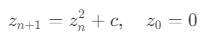
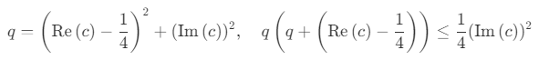
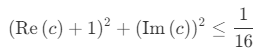
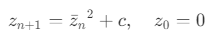
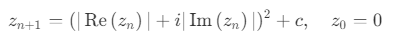
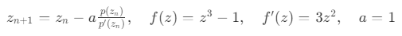
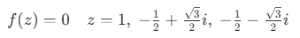

# Complex Fractal Renderer

## Controls

-   Left Mouse - Click to offset view
-   Right Mouse - Click to see the trajectory of a point
-   Scroll Wheel - Zoom in and out
-   TAB - Toggle UI
-   R - Reset view
-   1 - Mandelbrot set
-   2 - Tricorn / Mandelbar set
-   3 - Burning Ship fractal
-   4 - Newton fractal

## [Mandelbrot set](https://en.wikipedia.org/wiki/Mandelbrot_set)

### Iterative Formula

### Cardioid Check

### Period-2 Bulb Check

## [Tricorn / Mandelbar set](<https://en.wikipedia.org/wiki/Tricorn_(mathematics)>)

### Iterative Formula

## [Burning Ship fractal](https://en.wikipedia.org/wiki/Burning_Ship_fractal)

### Iterative Formula

## [Newton fractal](https://en.wikipedia.org/wiki/Newton_fractal)

### Iterative Formula

### Roots

## Find a bug?

If you found an issue or would like to suggest an improvement to this project, please submit an issue using the issues tab above. If you would like to submit a PR with a fix, reference the issue you created!

## Like this project?

If you find this project interesting or useful, consider giving it a star ⭐️!
